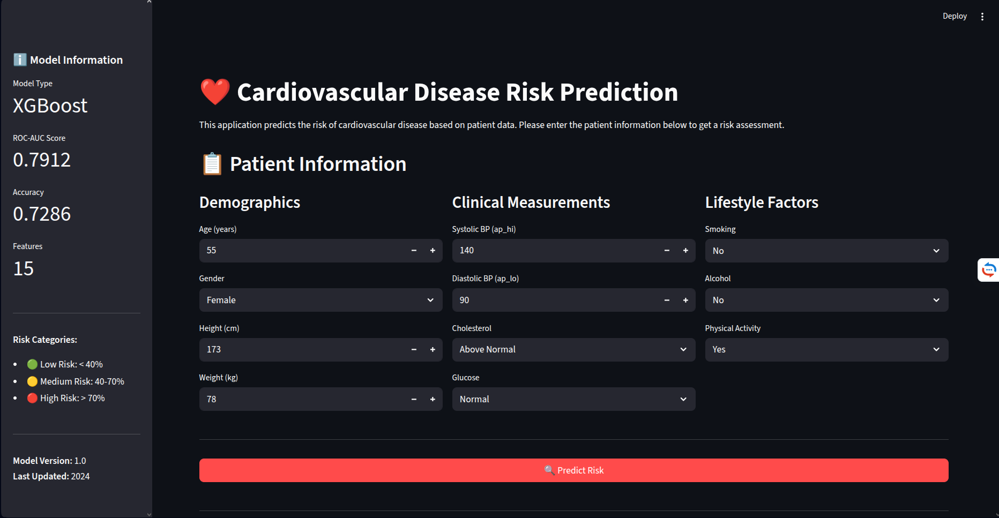
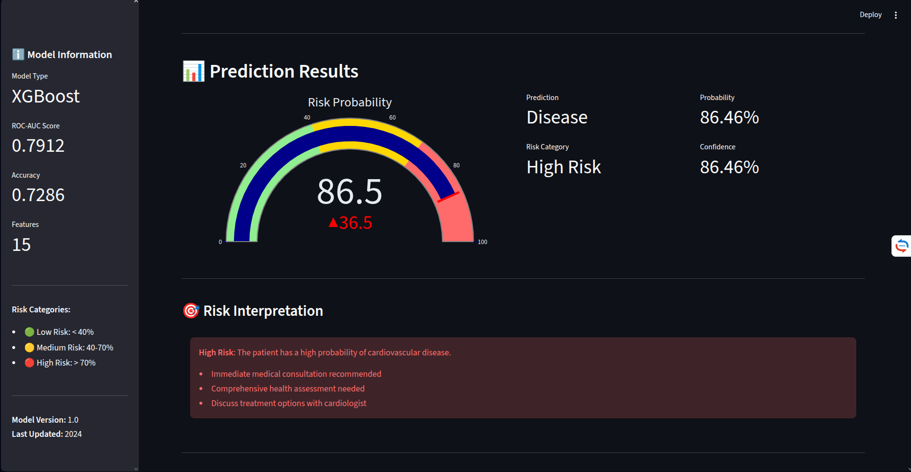

# ❤️ Cardiovascular Disease Prediction

A complete end-to-end machine learning project for predicting cardiovascular disease risk using patient health data.


## 📋 Project Overview

This project was developed as part of the **Zero2End Machine Learning Bootcamp** final project. It implements a complete machine learning pipeline for cardiovascular disease risk prediction, from data exploration to deployment.

### 🎯 Problem Statement

Cardiovascular diseases are the leading cause of death globally. Early detection and risk assessment are crucial for prevention and treatment. This project aims to:

- Predict cardiovascular disease risk based on patient health metrics
- Provide interpretable risk assessments for medical professionals
- Enable early intervention through accurate risk stratification

### 📊 Dataset

- **Source:** [Kaggle - Cardiovascular Disease Dataset](https://www.kaggle.com/datasets/sulianova/cardiovascular-disease-dataset)
- **Size:** ~70,000 patient records
- **Features:** 11 clinical and lifestyle features
- **Target:** Binary classification (Disease / Healthy)

---

### 📸 Screenshots




---

## 🏗️ Project Structure
```
cardiovascular-disease-prediction/
├── .gitignore
├── README.md
├── requirements.txt
├── data/
│   ├── raw/
│   │   └── cardio_train.csv
│   └── processed/
|       ├── feature_importance.csv
│       ├── final_features.json
│       └── final_feature_importance.csv
├── notebooks/
│   ├── 01_eda.ipynb
│   ├── 02_baseline.ipynb
│   ├── 03_feature_engineering.ipynb
│   ├── 04_model_optimization.ipynb
│   ├── 05_model_evaluation.ipynb
│   └── 06_final_pipeline.ipynb
├── src/
│   ├── __init__.py
│   ├── config.py
│   ├── inference.py
│   └── app.py
├── models/
|   ├── example_input.json
|   ├── model_summary.txt
│   ├── final_model.pkl
│   ├── scaler.pkl
│   ├── final_features.json
│   ├── model_params.json
│   └── model_metadata.json
└── tests/
```

---

## 🔧 Technical Details

### Model Information

- **Algorithm:** XGBoost Classifier (Gradient Boosting)
- **Features Used:** 15 optimized features (selected from 27 engineered features)
- **Training Data:** 55,000+ samples (after cleaning)
- **Validation:** 5-Fold Stratified Cross-Validation

### Performance Metrics

| Metric | Score |
|--------|-------|
| **ROC-AUC** | **0.7912** |
| **Accuracy** | **0.7286** |
| **F1-Score** | 0.7250 |
| **Sensitivity** | 0.73 |
| **Specificity** | 0.73 |

### Model Pipeline
```
Raw Data → Data Cleaning → Feature Engineering → 
Feature Selection → Scaling → XGBoost Prediction → Risk Assessment
```

---

## 📈 Project Workflow

### 1. Exploratory Data Analysis (EDA)
- Dataset overview and statistics
- Missing value analysis
- Target distribution analysis
- Feature distributions and correlations
- Outlier detection

**Key Findings:**
- Balanced dataset (50-50 class distribution)
- Strong correlations: age, blood pressure, cholesterol
- Significant outliers requiring cleaning

### 2. Baseline Model
- **Model:** Logistic Regression
- **Features:** 11 original features
- **Performance:** ROC-AUC 0.7700
- **Purpose:** Establish performance benchmark

### 3. Feature Engineering
- Created 16 new features:
  - **Numerical:** BMI, pulse pressure, MAP, health risk score, interactions
  - **Categorical:** Age groups, BMI categories, BP categories
- Tested 3 feature sets
- **Improvement:** +2-3% over baseline

### 4. Model Optimization
- **Hyperparameter Tuning:** Optuna (Bayesian Optimization)
- **Models Tested:** XGBoost, LightGBM, CatBoost, Random Forest
- **Best Model:** XGBoost
- **Trials:** 50 for XGBoost, 20 for LightGBM, 15 for CatBoost
- **Improvement:** +1% over unoptimized models

### 5. Model Evaluation
- **SHAP Analysis:** Feature importance and model interpretability
- **Feature Selection:** Reduced from 27 to 15 features
- **Optimal Features:** Maintained 99% of max performance
- **Business Alignment:** Clinical validity confirmed

### 6. Final Pipeline
- Production-ready preprocessing pipeline
- Model serialization and artifact management
- Inference API development
- Comprehensive testing

---

## 🛠️ Technologies Used

### Machine Learning
- **Scikit-learn** - ML pipeline and preprocessing
- **XGBoost** - Gradient boosting classifier
- **LightGBM** - Alternative gradient boosting
- **CatBoost** - Categorical boosting
- **Optuna** - Hyperparameter optimization
- **SHAP** - Model interpretability

### Data Processing & Visualization
- **Pandas** - Data manipulation
- **NumPy** - Numerical computing
- **Matplotlib** - Static visualizations
- **Seaborn** - Statistical visualizations
- **Plotly** - Interactive visualizations

### Deployment
- **Streamlit** - Web application framework
- **FastAPI** - REST API (optional)
- **Joblib** - Model serialization

### Development Tools
- **Jupyter** - Interactive notebooks
- **Git** - Version control
- **Python 3.10+** - Programming language

---

## 💻 Local Installation

### Prerequisites

- Python 3.10 or higher
- pip package manager
- Git

### Installation Steps

1. **Clone the repository**
```bash
git clone https://github.com/ebrudeniz/cardiovascular-disease-prediction.git
cd cardiovascular-disease-prediction
```

2. **Create virtual environment**
```bash
python -m venv venv
source venv/bin/activate  # On Windows: venv\Scripts\activate
```

3. **Install dependencies**
```bash
pip install -r requirements.txt
```

4. **Download dataset**
```bash
# Place cardio_train.csv in data/raw/
# Or use Kaggle API:
kaggle datasets download -d sulianova/cardiovascular-disease-dataset
unzip cardiovascular-disease-dataset.zip -d data/raw/
```

5. **Run notebooks (optional)**
```bash
jupyter notebook
# Open notebooks/ folder and run in order: 01 → 06
```

6. **Run Streamlit app**
```bash
streamlit run src/app.py
```

The app will open at `http://localhost:8501`

---

## 🔍 Usage

### Web Application

1. Run the Streamlit app:
```bash
streamlit run src/app.py
```

2. Enter patient information:
   - Demographics (age, gender, height, weight)
   - Clinical measurements (blood pressure, cholesterol, glucose)
   - Lifestyle factors (smoking, alcohol, physical activity)

3. Click "Predict Risk" to get:
   - Risk probability (0-100%)
   - Risk category (Low/Medium/High)
   - Calculated health metrics (BMI, pulse pressure, etc.)
   - Risk interpretation and recommendations

### Python API
```python
from src.inference import CardiovascularPredictor

# Initialize predictor
predictor = CardiovascularPredictor()

# Prepare input
patient_data = {
    "age": 18393,  # in days
    "gender": 2,   # 1=female, 2=male
    "height": 168,
    "weight": 62,
    "ap_hi": 110,
    "ap_lo": 80,
    "cholesterol": 1,  # 1=normal, 2=above, 3=well above
    "gluc": 1,         # 1=normal, 2=above, 3=well above
    "smoke": 0,
    "alco": 0,
    "active": 1
}

# Make prediction
result = predictor.predict(patient_data)

print(f"Risk: {result['probability']:.2%}")
print(f"Category: {result['risk_category']}")
```

---

## 📊 Model Features

### Top 15 Most Important Features

1. **age** - Patient age (years)
2. **ap_hi** - Systolic blood pressure
3. **weight** - Body weight (kg)
4. **cholesterol** - Cholesterol level (1-3)
5. **ap_lo** - Diastolic blood pressure
6. **bmi** - Body Mass Index (calculated)
7. **pulse_pressure** - Pulse pressure (calculated)
8. **map** - Mean arterial pressure (calculated)
9. **gluc** - Glucose level (1-3)
10. **bp_category_hypertension_stage1** - BP category
11. **bp_category_hypertension_stage2** - BP category
12. **bmi_category_overweight** - BMI category
13. **bmi_category_obese** - BMI category
14. **health_risk_score** - Composite risk score
15. **gender_age_interaction** - Interaction feature

---

## 🎯 Model Validation

### Validation Strategy
- **Method:** Stratified Train-Test Split (80-20)
- **Cross-Validation:** 5-Fold Stratified
- **Metrics:** ROC-AUC (primary), Accuracy, F1-Score

### Results vs Baseline

| Model | ROC-AUC | Improvement |
|-------|---------|-------------|
| Baseline (Logistic Regression) | 0.7700 | - |
| + Feature Engineering | 0.7800 | +1.3% |
| + Model Optimization (XGBoost) | 0.7904 | +2.6% |
| **Final (Selected Features)** | **0.7912** | **+2.75%** |

---

## 🚨 Threshold Recommendations

| Use Case | Threshold | Recall | Precision | Notes |
|----------|-----------|--------|-----------|-------|
| **Screening** | 0.35-0.40 | High (~0.80) | Lower | Maximize sensitivity |
| **Balanced** | 0.50 | Medium (~0.73) | Medium | Default setting |
| **Diagnosis Support** | 0.60-0.65 | Lower | High (~0.80) | High confidence only |

---

## 📚 Documentation

### Notebooks
- **01_eda.ipynb** - Exploratory Data Analysis
- **02_baseline.ipynb** - Baseline Model Development
- **03_feature_engineering.ipynb** - Feature Engineering Experiments
- **04_model_optimization.ipynb** - Hyperparameter Tuning
- **05_model_evaluation.ipynb** - Model Evaluation & SHAP Analysis
- **06_final_pipeline.ipynb** - Final Production Pipeline

### Key Decisions Documented

1. **Why 15 features?**
   - Optimal balance between performance and complexity
   - 99% of maximum performance with 44% fewer features
   - Faster inference and easier deployment

2. **Why XGBoost?**
   - Best performance in optimization trials
   - Native feature importance
   - Production-ready and well-supported

3. **Validation Strategy**
   - Stratified split maintains class balance
   - Cross-validation ensures robustness
   - Test set simulates production environment

---

## ⚠️ Limitations & Disclaimers

### Model Limitations
- Trained on specific dataset (may not generalize to all populations)
- Requires accurate measurements (garbage in, garbage out)
- Static snapshot (does not capture disease progression)
- Does not include all clinical risk factors

### Usage Disclaimers
⚠️ **This tool is for educational and screening purposes only.**
- NOT a substitute for professional medical advice
- NOT for definitive diagnosis
- NOT for emergency medical situations
- Always consult healthcare professionals for medical decisions

---

## 🔮 Future Improvements

### Model Enhancements
- [ ] Ensemble methods (stacking, blending)
- [ ] Deep learning models (neural networks)
- [ ] Time-series data for disease progression
- [ ] More comprehensive feature set
- [ ] Multi-class risk stratification

### Engineering Improvements
- [ ] Real-time model monitoring dashboard
- [ ] A/B testing framework
- [ ] Model versioning and rollback
- [ ] Automated retraining pipeline
- [ ] Data drift detection

### Deployment
- [ ] Docker containerization
- [ ] Kubernetes orchestration
- [ ] CI/CD pipeline
- [ ] Load balancing
- [ ] API rate limiting

---

## 🧪 Testing

### Run Tests
```bash
# Unit tests
python -m pytest tests/

# Test inference
python src/inference.py

# Test app locally
streamlit run src/app.py
```

---

## 📄 License

This project is licensed under the MIT License - see the [LICENSE](LICENSE) file for details.

---

## 👤 Contact

**Your Name**
- GitHub: [@YOUR_USERNAME](https://github.com/ebrudeniz)
- LinkedIn: [Your LinkedIn](https://linkedin.com/in/ebru-deniz)
- Email: your.email@example.com

---

## 🙏 Acknowledgments

- **Zero2End ML Bootcamp** - For the comprehensive machine learning curriculum
- **Kaggle** - For providing the cardiovascular disease dataset
- **Svetlana Ulianova** - Dataset creator
- **Open Source Community** - For the amazing ML tools and libraries

---

## 📊 Project Statistics

- **Lines of Code:** ~3,000+
- **Notebooks:** 6 comprehensive notebooks
- **Models Trained:** 20+ model variations
- **Features Engineered:** 16 new features
- **Optimization Trials:** 105 hyperparameter combinations
- **Development Time:** ~2-3 weeks

---

## ⭐ Star History

If you found this project helpful, please give it a star! ⭐

---
